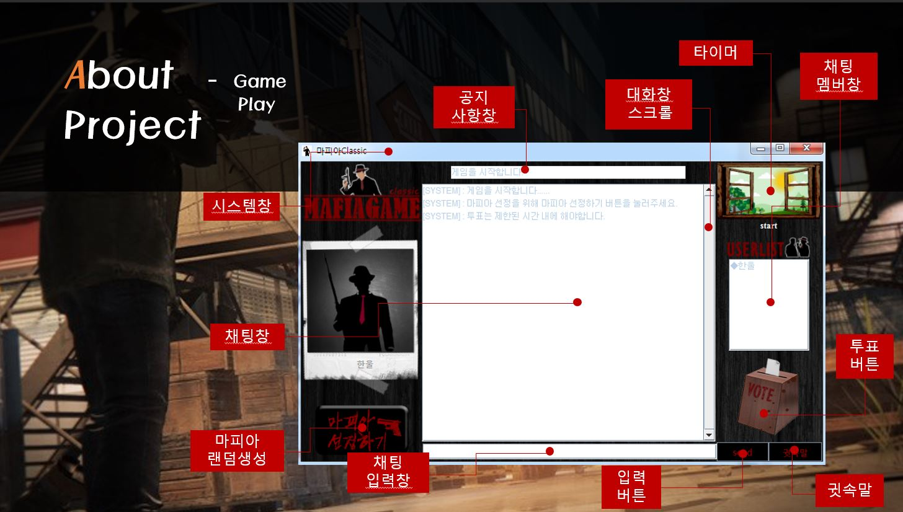

# MafiaProject [스마트 웹&앱 콘텐츠 개발자과정]
## 소켓통신을 이용한 마피아 게임 제작
#### :pencil: 1st Practice : java project using Socket
##### JAVA-소켓통신을 이용해 server 구축 / client 구축 
##### oracle DB를 이용해 사용자 정보 저장 
##### Thread로 다중 접속 구현 
##### Timer, ActionListener 이용 타이머 기능 구현 

***

 > before start
 > 1. chage setting of DB(url, id, password)
 > 2. chage setting of IP address
 > 2. server run
 > 3. client run

***

#### :camera: run image

 - login
 
 
 
  - main
 
 
 
  - end
  
  

***

#### :blush: check Doc
[프로젝트 PPT 자료](./doc/마피아게임(16.08.31).pptx)
